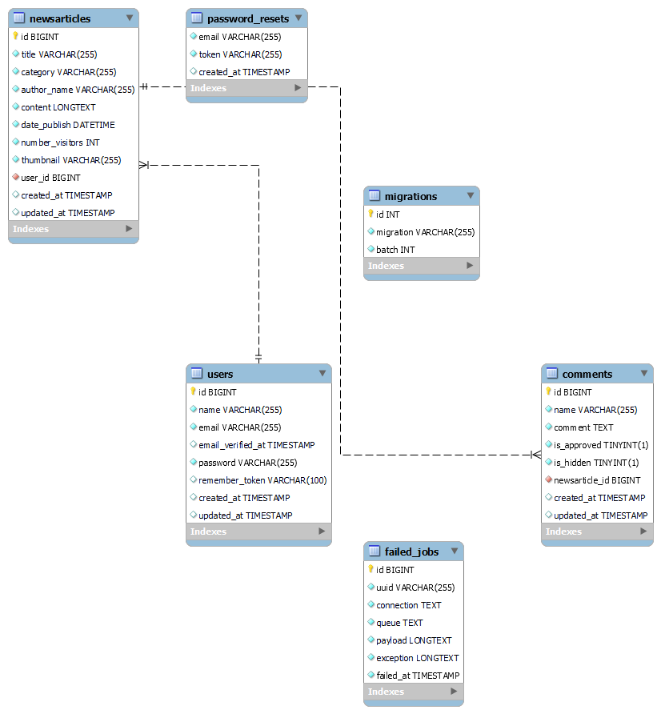

<h1 align="center">Saudi Arabia News</h1>

<p align="center">

</p>

                
<p align="center">
  <a href="#Introduction">Introduction</a> •
  <a href="#demo">Demo</a> •
  <a href="#Key Features">Key Features</a> •
  <a href="#ERD">ERD</a> •
  <a href="#Technology Used">Technology Used</a>
</p>
<div id="Introduction">
    
# Introduction 

Saudi arabia news is a news website built using php laravel, the website shows news from all around the world, which focus more on Saudi news. the UI/UX of the website was specifically designed to fit the needs of news enthusiastic individuals,the front-end design was meant to be for the age group between 35-60 and makes it easier to browse the news and to comment on them
    
</div>

<div id="demo">

# Demo
    
[Check it here](http://157.175.57.12/)

</div>

<div id="Key Features">

# Key Features

- **Simple**, **Easy-To-Use** user interface
- Admin dashboard with News statistic charts
- Regular and **Advance** Search
- **Browsing** news
- Fully CRUD Operations on **Comments**
- Fully CRUD Operations on **Articles**
- Authentication and Authorization for Admin

</div>

<div id="ERD">

# Development Prerequisites
* PHP >= 7.4
* Composer >=  2.1
* XAMPP => 7.4
* Node => 14.17
* MySQL => 8.0


# Installation
After cloning the repo, make sure you edit the `.env` file (see `.env.example`) to accomodate your database name and credentials, and be sure to create the database in advance in MySQL (e.g. `CREATE DATABASE <database-name>`). Then, install all composer dependencies, followed by npm dependencies installation and building as shown below:
    
   ```sh
   ### 1- Install composer dependencies   
   composer install
   ### 2- Install npm dependencies
   npm install
   ### 3- Build for a development environment
   npm run dev
   ### 4- Make the database migrations and start seeding
   php artisan migrate --seed
   ### 5- Make the file uploads storage folder publicly accessable
   php artisan storage:link
   ### 6- Start serving the project locally :)
   php artisan serve
   ```

# Entity-Relation Diagram
    
<div align="center">

</div>

</div>

<div id="Technology Used">

## Technology Used

<a href="https://laravel.com/" title="Laravel"></a> PHP Laravel
    
<a href="https://dev.mysql.com/" title="MySQL"></a> MySQL
    
    
<a href="https://www.w3.org/TR/html5/" title="HTML5"></a> HTML
    
    
<a href="https://www.w3.org/TR/CSS/" title="CSS3"></a> CSS
    
    
<a href="https://developer.mozilla.org/en-US/docs/Web/JavaScript" title="JavaScript"></a> JavaScript
    
    
<a href="https://tailwindcss.com/" title="Tailwind CSS"></a> Tailwind
    
    
<a href="https://www.nginx.com/" title="Nginx"></a> Nginx
    
    
<a href="https://aws.amazon.com/" title="AWS"></a> AWS EC2

</div>

## Developer 

> Hussain Alghamdi 

## License

> [](https://opensource.org/licenses/MIT)

